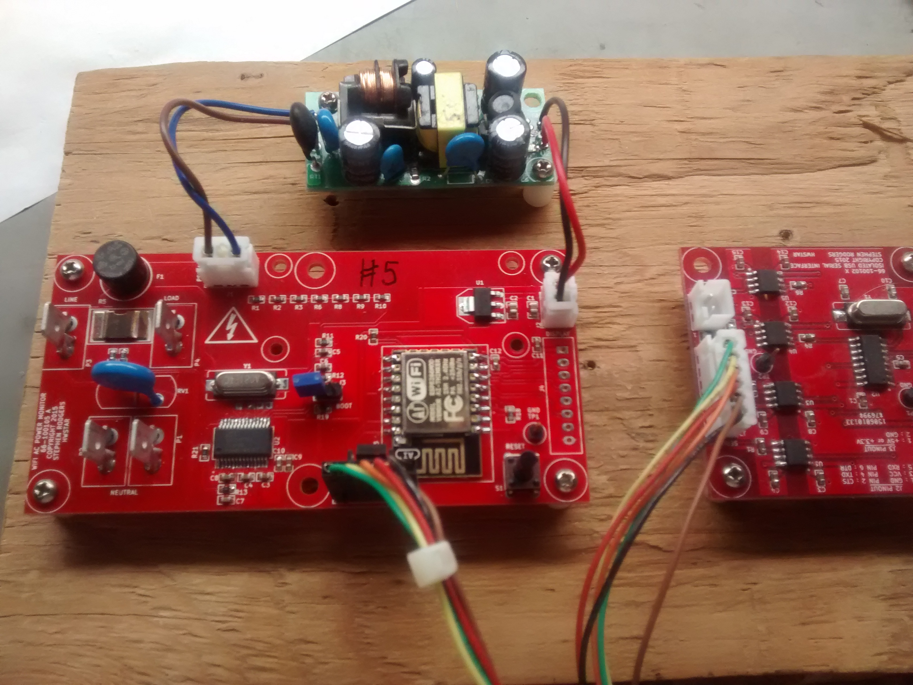
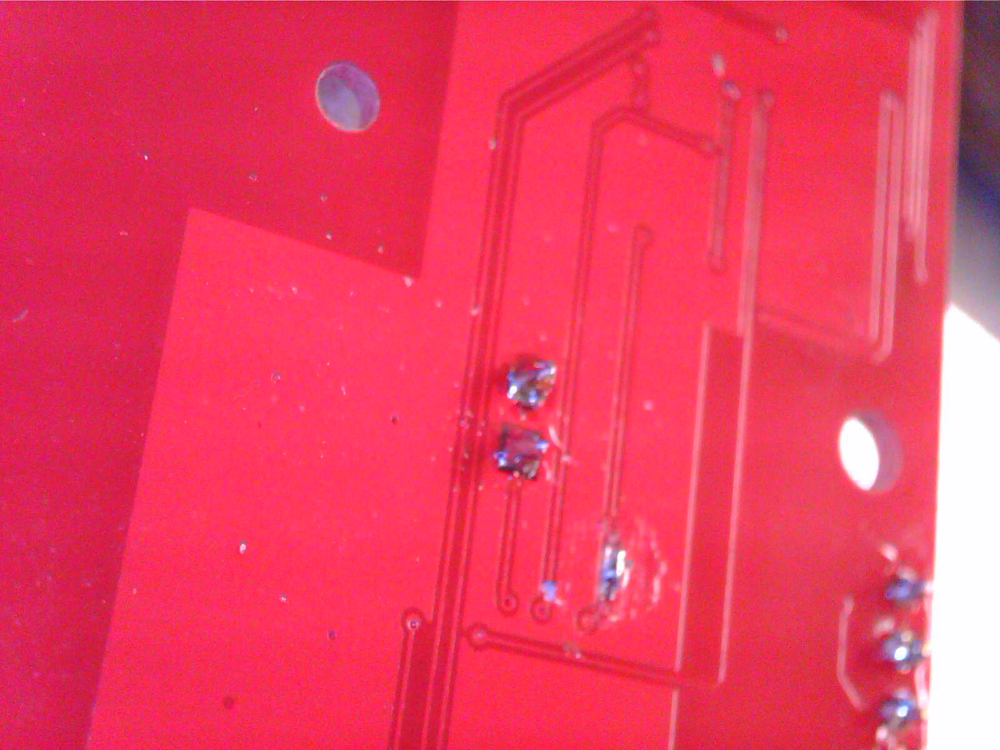

**HW-AC-Emeter**
==========
This is the hardware implementation for my Atmel 90E24 power line monitor project. The Atmel 90E24 is a complete energy management solution on a chip. It allows
voltage, current, true power, apparent power, reactive power, power factor, phase angle, and line frequency to be accurately measured. Additionally it can measure
energy and with firmware, you can convert the energy pulses into kilowatt hours.

**Features:**

This board contains an ESP12 module, and an Atmel 90E24 Energy monitor chip.
The board can be powered from any floating voltage source from 5V to 12V. You can optionally stuff an ESP8266 or an 8 pin connector for use with an AVR (Arduino board) or other
microprocessor which has 3 free GPIO pins. The board partially shown on the far right is used to isolate the serial data signals from the ESP8266 from mains potential to protect your computer (see NB below).
I have a separate project on Github for the [isolated USB serial port](http://github.com/hwstar/ISO-Port) 

The board is inserted into a the live (phase) and neutral leads going to a a load which runs on mains voltages.

There is a 1 milliohm current shunt on the live  side of the connections. This allows up to 24 amps to be measured.

NB: See the disclaimer below. This project is not for beginners. THE LOGIC GROUND FOR THE ATMEL 90E24 IS CONNECTED DIRECTLY TO THE AC LIVE LEAD. This means you must heed the following warnings:

1. If you want to use test equipment on this project, an isolation transformer with floating live and neutral leads is ABSOLUTELY REQUIRED if
you want to keep your scope or other grounded test equipment from being BLOWN UP. 

2. The SPI signals going to your microprocessor are not isolated from mains so your whole system will
be at line potential. Hooking these up to something which is not floating WILL cause everything connected to be DESTROYED.

3. The serial data signals on the ESP8266 version are also not isolated and are at line potential. It is absolutely required that you use an isolated USB serial interface to prevent your computer
from being BLOWN UP.

4. The power supply for Atmel 90E24 must be floating. Do not use your lab power supply or any other power supply which is not floating. Use an ungrounded 5 volt wall wart for testing.

**EDA Software**

This board was designed using KICAD. 

**Calibration**

This is the challenging part. I took some shortcuts and cut some corners. Read the 90E24 data sheet about how to go about this correctly. You need to have some way of presenting known AC loads to the unit, and correlating the results seen in the registers. 
I used a 60 watt bulb as a resistive load. This is really far from ideal as your wall socket mains voltage will vary enough to make the effort challenging and error-prone. If you have access to a stable AC power
source (K$) and precision resistive and reactive AC loads (K$), then the calibration will be much easier. The firmware will save calibration  values to non volatile memory. 

Here is my procedure for the ESP8266 version (which can probably be improved)

1. With an AC source connected no load connected, calibrate the RMS voltage by writing test values to  the Ugain register address 0x31. Example mqtt command: 
{"command":"register","addr":"31","value":"XXXX"} Where XXXX is a 4 digit hex number. Read back voltage values using the query command, and adjust Ugain until you achieve reasonable correlation. It helps to do this
when your mains voltage is the most stable (Early in the morning). The Ugain calibration values on I saw were between 0x6410 and 0x6460
2. Next, read the current with a load disconnected, and note that there is a small offset on Irms. We need to zero out this offset before we calibrate the current. 
We will need to write values to the IoffsetL register at address 0x35. The values I saw were between 0xF7E0 and 0xF8A0.
3. Connect a resistive load and an accurate current meter such as a true RMS 5 1/2 digit DMM. Adjust the value in the IGAIN register 0x32 so that the reading on the accurate current meter matches
the IRMS value returned by the query command. The calibration values for the Igain register I saw were between 0x4A00 and  0x4AC0.
4. Make sure the PstartTH is set to its default value of 0x8BD in register 0x27. 
5. Disconnect any load. Write 0x400 into the PNolTh register at address 0x28. This prevents the unit from metering at very low currents like when there is no load connected.
6. Make sure the LPHI register at address 0x24  is set to 0. Reactive load calibration is a future improvement to this procedure. 
7. Connect a known resistive load which is switched off. Reset the kwh accumulator in the firmware using the MQTT command {"command":"resetkwh"}. Arm a stopwatch. 
Turn on the load and start the stopwatch simultaneously. Run for 6 minutes, and turn off the load. Note the kWh returned with a query command. This will be 1/10 of the desired value. If it is off, 
adjust the value in the Lgain register at address 0x27, reset the kwh accumulator, and repeat until correlation is acheived. The values I saw were between 0xF200 and 0xF300.

Note that this procedure does not encompass using small power mode as recommended in the datasheet.

There are 2 registers used for adjusting the reactive measurements. Lphi (0x24) which adjusts the phase angle and power factor, and QoffsetL (0x38) which adjusts reactive power (Qmean). 
Once the calibration procedure above is completed, Qmean can be calibrated by using the power triangle formula: Qmean = sqrt(Smean^2 - Pmean^2). Where Smean is the apparent power, and Pmean
is the true power. Adjust QoffsetL until qmean matches the calculated value. Once QOffsetL is adjusted, then adjust Lphi to get the power factor to match a calibrated meter.

**Board Size**

5cm x 10cm

**Some Rework Required on rev X1 board blanks**

Rev X1 boards will require rework to connect the ~CS line to logic ground the 90E24 and open the ~CS and IRQ lines to the ESP8266.  My ESP8266 devices want to force GPIO5 high
and this prevents the line from being used as a chip select. For use with the AVR firmware, ~CS must also be connected to logic ground. 
This can be accomplished by scraping away the ground soldermask and bridging ground to the ~CS line. See the rework picture below for details.

If there is enough interest, I'll spin a rev A board blank. The X1 blanks are useable even though they have a bodge on the bottom side of the board.

Rework picture:

1. The cut on the left is the IRQ line
2. The cut and solder bridge on the right is the ~CS line.
3. Optional: Add 3.3V to pin 3 of the ESP8266 programming if you are using one of my isolator boards.

**Firmware**

The AVR firmware for this project can be found [here](https://github.com/hwstar/FW-AC-Emeter)
The ESP8266 firmware for this project can be found [here](https://github.com/hwstar/FW-AC-Emeter-ESP8266)

**LICENSE**

Creative Commons Attribution Share-Alike license. (CC-BY-SA)

**Disclaimer**

Build and use at your own risk. This board uses potentially lethal mains voltages. 

I will not be responsible for any damages including but not limited to: errors or omissions, loss of life, or property damage. You have been warned.

